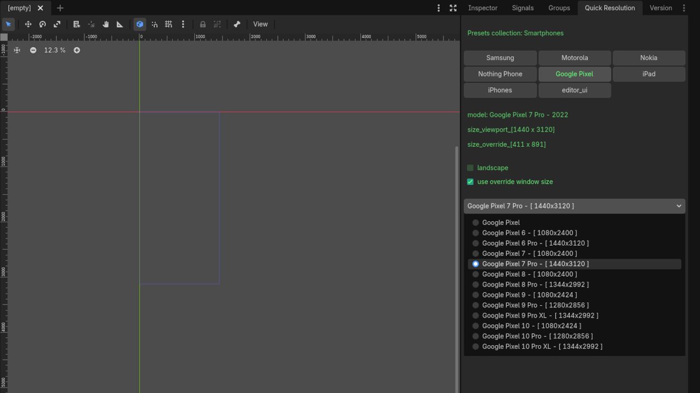

# Godot Quick Resolution

 

**Quickly change and test different Project Resolution settings** directly from the Godot editor.

A lightweight editor plugin that lets you instantly switch between common resolutions (including many real device resolutions) without manually editing `project.godot` every time. Perfect for testing how your game looks on phones, tablets, desktops, and various aspect ratios.

## Features

- One-click resolution switching in the editor
- Preloaded list of common and device-specific resolutions
- Fast testing of different window sizes and aspect ratios
- Minimal and non-intrusive design
- Easy to add your own custom resolutions

## Installation

1. Download or clone this repository.
2. Copy the `addons/quick_resolution/` folder into your Godot project's `addons/` directory.
3. Open your project in Godot.
4. Go to **Project → Project Settings → Plugins** and enable **Quick Resolution**.

The plugin should now appear in the editor (usually as a right dock).

## Usage

Once enabled, the plugin provides an easy interface to:
- Select from a list of predefined resolutions
- Apply the resolution immediately in the editor
- Test your game's UI and gameplay at different sizes
- Customize. (See `/resources/presets/`) Serialize your own `ResolutionGroupsCollection` into the editor's scene `QuickResolutionEditorUI` -> `/scenes/quick_resolution_editor_plugin.tscn` and work with your target platform's presets.

### Device Resolutions

The addon includes many real-world device resolutions sourced from:
- [screensizechecker.com/devices](https://screensizechecker.com/devices)
- [gsmarena.com](https://www.gsmarena.com/)

Any contribution — whether new resolution devices or functionality — is greeted with a warm welcome.❤️
